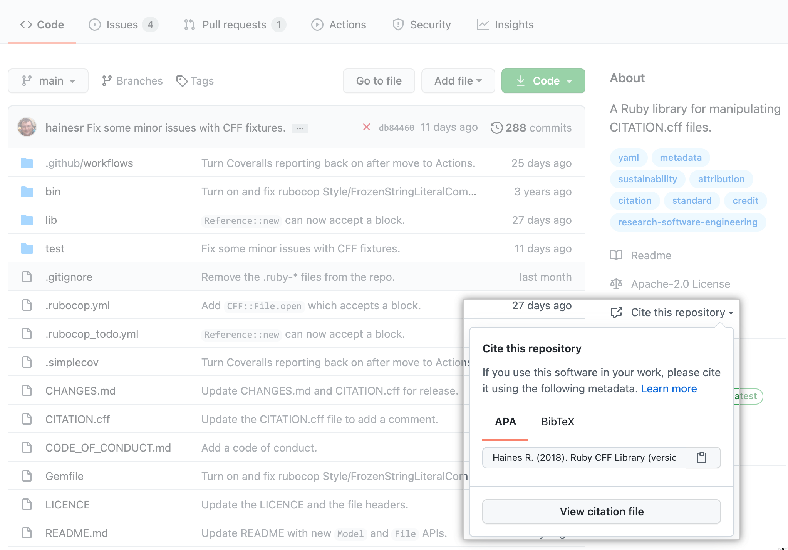

<!-- README.md is generated from README.Rmd. Please edit that file -->

```{r, include = FALSE}
knitr::opts_chunk$set(
  collapse = TRUE,
  comment = "#>",
  fig.path = "man/figures/README-",
  out.width = "100%"
)
```

# cffr <a href='https://docs.ropensci.org/cffr/'></a>

<!-- badges: start -->

[](https://github.com/ropensci/cffr/actions/workflows/check-full.yaml)
[](https://app.codecov.io/gh/ropensci/cffr)
[](https://ropensci.r-universe.dev/)
[](https://github.com/ropensci/cffr/actions/workflows/cff-validator.yml)
[](https://doi.org/10.5281/zenodo.5509766)
[](https://www.repostatus.org/#active)

[](https://github.com/ropensci/software-review/issues/463)

<!-- badges: end -->

## What is a `CITATION.cff` file?

[Citation File Format (CFF)](https://citation-file-format.github.io/)
[@Druskat_Citation_File_Format_2021] (v1.2.0) are plain text files with human-
and machine-readable citation information for software (and datasets). Code
developers can include them in their repositories to let others know how to
correctly cite their software.

This format is becoming popular within the software citation ecosystem. Recently
[GitHub](https://docs.github.com/en/repositories/managing-your-repositorys-settings-and-features/customizing-your-repository/about-citation-files),
[Zenodo](https://twitter.com/ZENODO_ORG/status/1420357001490706442) and
[Zotero](https://twitter.com/zotero/status/1420515377390530560) have included
full support of this citation format [@making_software]. GitHub support is of special interest:

*See [Customize your repository/About CITATION
files](https://docs.github.com/en/repositories/managing-your-repositorys-settings-and-features/customizing-your-repository/about-citation-files)*


> When you add a CITATION.cff file to the default branch of your repository, it is
> automatically linked from the repository landing page. This makes it easy for
> other users to cite your software project, using the information you've
> provided.

```{r echo=FALSE, out.width="80%", fig.align='center', fig.alt="citation-link"}

```

### Related projects

[The CodeMeta Project](https://codemeta.github.io/) [@codemeta_2_0] creates a
concept vocabulary that can be used to standardize the exchange of software
metadata across repositories and organizations. One of the many uses of a
`codemeta.json` file (created following the standards defined on The CodeMeta
Project) is to provide citation metadata such as title, authors, publication
year, and venue [@aligning_codemeta]. The packages
[**codemeta**](https://github.com/cboettig/codemeta)/
[**codemetar**](https://github.com/ropensci/codemetar) allows to generate
`codemeta.json` files from R packages metadata.

## The cffr package

**cffr** provides utilities to generate, parse, modify and validate
`CITATION.cff` files automatically for **R** packages, as well as tools and
examples for working with .cff more generally.

**cffr** maximizes the data extraction by using both the `DESCRIPTION` file and
the `CITATION` file (if present) of your package. Note that **cffr** works best
if your package pass `R CMD check/devtools::check()`.

### Installation

You can install the developing version of **cffr** with:

```{r, eval=FALSE}
devtools::install_github("ropensci/cffr")
```

Alternatively, you can install **cffr** using the
[r-universe](https://ropensci.r-universe.dev/ui#builds):

```{r, eval=FALSE}

# Enable this universe
options(repos = c(
  ropensci = "https://ropensci.r-universe.dev",
  CRAN = "https://cloud.r-project.org"
))

# Install some packages
install.packages("cffr")
```

### Example

By default most often from within your package folder you'll simply run
`cff_write()`, that creates a `cff` object, write it on a `CITATION.cff` file
and validates it on a single command.

However, **cffr** provides also custom print methods and mechanisms that allows
you to customize the `CITATION.cff` and integrate them in your workflows.

This is a basic example which shows you how to create a `cff` object (see `?cff`
for more info). In this case, we are creating a `cff` object from the metadata
of the **rmarkdown** package:

```{r }
library(cffr)

# Example with an installed package
test <- cff_create("rmarkdown")
```

<details><summary>
<code>CITATION.cff</code> for <strong>rmarkdown</strong></summary>


```{r, echo=FALSE, comment=""}

test
```

</details>

<p>

<p>

<p>

We can validate the result using `cff_validate()`:

```{r }

cff_validate(test)
```

Check the [docs](https://docs.ropensci.org/cffr/reference/index.html) and
`vignette(package = "cffr")` to learn how to work with `cff` objects.

## Related packages

-   [**citation**](https://github.com/pik-piam/citation/): The development
    version (at the time of this writing) includes a new function `r2cff` that
    creates a `CITATION.cff` file (v1.1.0) using the information of your
    `DESCRIPTION` file. It also provide minimal validity checks.
-   [**handlr**](https://github.com/ropensci/handlr): Tool for converting among
    citation formats, including `*.cff` files. At the time of this writing only
    CFF v1.1.0 was supported (see
    [\#24](https://github.com/ropensci/handlr/issues/24)).
-   [**codemeta**](https://github.com/cboettig/codemeta)/
    [**codemetar**](https://github.com/ropensci/codemetar) provides similar
    solutions for creating `codemeta.json` file, another format for storing and
    sharing software metadata.

## Citation

```{r echo=FALSE, results='asis'}
print(citation("cffr")[1], bibtex = FALSE)
```

A BibTeX entry for LaTeX users is

```{r echo=FALSE}
toBibtex(citation("cffr")[1])
```

You can also use the [citation provided by
GitHub](https://github.com/ropensci/cffr), that is generated from the
information of a `CITATION.cff` created with **cffr**. See [About CITATION
files](https://docs.github.com/en/repositories/managing-your-repositorys-settings-and-features/customizing-your-repository/about-citation-files)
for more info.

## References
