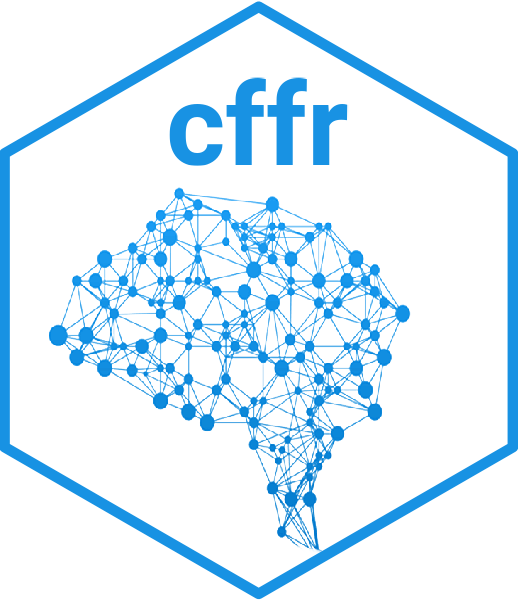
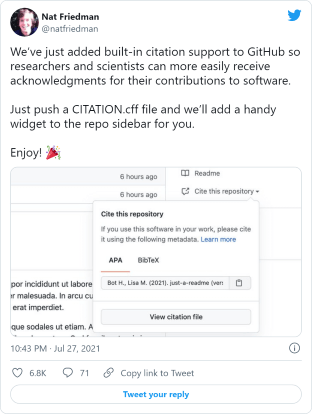

<!-- README.md is generated from README.Rmd. Please edit that file -->

# cffr <a href="https://docs.ropensci.org/cffr/"></a>

<!-- badges: start -->

[](https://CRAN.R-project.org/package=cffr)
[](https://cran.r-project.org/web/checks/check_results_cffr.html)
[](https://cran.r-project.org/package=cffr)
[](https://github.com/ropensci/cffr/actions/workflows/check-full.yaml)
[](https://github.com/ropensci/cffr/actions/workflows/rhub.yaml)
[](https://app.codecov.io/gh/ropensci/cffr)
[](https://ropensci.r-universe.dev/cffr)
[](https://github.com/ropensci/cffr/actions/workflows/cff-validator.yml)
[](https://doi.org/10.21105/joss.03900)
[](https://www.repostatus.org/#active)

[](https://github.com/ropensci/software-review/issues/463)

<!-- badges: end -->

**cffr** provides utilities to generate, coerce, modify and validate
`CITATION.cff` files automatically for **R** packages, as well as tools
and examples for working with .cff more generally.

## What is a `CITATION.cff` file?

[Citation File Format (CFF](https://citation-file-format.github.io/))
([Druskat et al. 2021](#ref-druskat_citation_2021)) (v1.2.0) are plain
text files with human- and machine-readable citation information for
software (and datasets). Code developers can include them in their
repositories to let others know how to correctly cite their software.

This format is becoming popular within the software citation ecosystem.
Recently
[GitHub](https://docs.github.com/en/repositories/managing-your-repositorys-settings-and-features/customizing-your-repository/about-citation-files),
[Zenodo](https://citation-file-format.github.io/#/supported-by-zenodo-)
and
[Zotero](https://citation-file-format.github.io/#/supported-by-zotero-)
have included full support of this citation format ([Druskat
2021](#ref-druskat_stephan_making_2021)). GitHub support is of special
interest:



*— Nat Friedman (@natfriedman) July 27, 2021*

See [Enhanced support for citations on
GitHub](https://github.blog/2021-08-19-enhanced-support-citations-github/)
([Smith 2021](#ref-smith2021)) for more info.

### Related projects

[The CodeMeta Project](https://codemeta.github.io/) ([Jones et al.
2017](#ref-jones2017)) creates a concept vocabulary that can be used to
standardize the exchange of software metadata across repositories and
organizations. One of the many uses of a `codemeta.json` file (created
following the standards defined on The CodeMeta Project) is to provide
citation metadata such as title, authors, publication year, and venue
([Fenner 2021](#ref-fenner2021)). The packages **codemeta** ([Boettiger
and Salmon 2021a](#ref-codemeta)) / **codemetar** ([Boettiger and Salmon
2021b](#ref-codemetar2021)) allows to generate `codemeta.json` files
from R packages metadata.

## The cffr package

**cffr** maximizes the data extraction by using both the `DESCRIPTION`
file and the `CITATION` file (if present) of your package. Note that
**cffr** works best if your package pass
`R CMD check/devtools::check()`.

As per 2024-07-23 there are at least 290 repos on GitHub using **cffr**.
[Check them out
here](https://github.com/search?q=cffr%20path%3A**%2FCITATION.cff&type=code).

### Installation

Install **cffr** from [CRAN](https://CRAN.R-project.org/package=cffr):

``` r
install.packages("cffr")
```

You can install the developing version of **cffr** with:

``` r
remotes::install_github("ropensci/cffr")
```

Alternatively, you can install **cffr** using the
[r-universe](https://ropensci.r-universe.dev/cffr):

``` r
# Install cffr in R:
install.packages("cffr",
  repos = c("https://ropensci.r-universe.dev", "https://cloud.r-project.org")
)
```

### Example

By default most often from within your package folder you’ll simply run
`cff_write()`, that creates a `cff` object, write it on a `CITATION.cff`
file and validates it on a single command:

``` r
library(cffr)

# For in-development packages
cff_write()
#>
#> CITATION.cff generated
#>
#> cff_validate results-----
#> Congratulations! This .cff file is valid
```

However, **cffr** provides also custom print methods and mechanisms that
allows you to customize the `CITATION.cff` and integrate them in your
workflows.

This is a basic example which shows you how to create a `cff` object
(see `?cff` for more info). In this case, we are creating a `cff` object
from the metadata of the **rmarkdown** package:

``` r
library(cffr)

# Example with an installed package
test <- cff_create("rmarkdown")
```

<details>
<summary>
<code>CITATION.cff</code> for <strong>rmarkdown</strong>
</summary>

    cff-version: 1.2.0
    message: 'To cite package "rmarkdown" in publications use:'
    type: software
    license: GPL-3.0-only
    title: 'rmarkdown: Dynamic Documents for R'
    version: '2.27'
    identifiers:
    - type: doi
      value: 10.32614/CRAN.package.rmarkdown
    abstract: Convert R Markdown documents into a variety of formats.
    authors:
    - family-names: Allaire
      given-names: JJ
      email: jj@posit.co
    - family-names: Xie
      given-names: Yihui
      email: xie@yihui.name
      orcid: https://orcid.org/0000-0003-0645-5666
    - family-names: Dervieux
      given-names: Christophe
      email: cderv@posit.co
      orcid: https://orcid.org/0000-0003-4474-2498
    - family-names: McPherson
      given-names: Jonathan
      email: jonathan@posit.co
    - family-names: Luraschi
      given-names: Javier
    - family-names: Ushey
      given-names: Kevin
      email: kevin@posit.co
    - family-names: Atkins
      given-names: Aron
      email: aron@posit.co
    - family-names: Wickham
      given-names: Hadley
      email: hadley@posit.co
    - family-names: Cheng
      given-names: Joe
      email: joe@posit.co
    - family-names: Chang
      given-names: Winston
      email: winston@posit.co
    - family-names: Iannone
      given-names: Richard
      email: rich@posit.co
      orcid: https://orcid.org/0000-0003-3925-190X
    preferred-citation:
      type: manual
      title: 'rmarkdown: Dynamic Documents for R'
      authors:
      - family-names: Allaire
        given-names: JJ
        email: jj@posit.co
      - family-names: Xie
        given-names: Yihui
        email: xie@yihui.name
        orcid: https://orcid.org/0000-0003-0645-5666
      - family-names: Dervieux
        given-names: Christophe
        email: cderv@posit.co
        orcid: https://orcid.org/0000-0003-4474-2498
      - family-names: McPherson
        given-names: Jonathan
        email: jonathan@posit.co
      - family-names: Luraschi
        given-names: Javier
      - family-names: Ushey
        given-names: Kevin
        email: kevin@posit.co
      - family-names: Atkins
        given-names: Aron
        email: aron@posit.co
      - family-names: Wickham
        given-names: Hadley
        email: hadley@posit.co
      - family-names: Cheng
        given-names: Joe
        email: joe@posit.co
      - family-names: Chang
        given-names: Winston
        email: winston@posit.co
      - family-names: Iannone
        given-names: Richard
        email: rich@posit.co
        orcid: https://orcid.org/0000-0003-3925-190X
      year: '2024'
      notes: R package version 2.27
      url: https://github.com/rstudio/rmarkdown
    repository: https://CRAN.R-project.org/package=rmarkdown
    repository-code: https://github.com/rstudio/rmarkdown
    url: https://pkgs.rstudio.com/rmarkdown/
    date-released: '2024-05-17'
    contact:
    - family-names: Xie
      given-names: Yihui
      email: xie@yihui.name
      orcid: https://orcid.org/0000-0003-0645-5666
    keywords:
    - literate-programming
    - markdown
    - pandoc
    - r
    - r-package
    - rmarkdown
    references:
    - type: book
      title: 'R Markdown: The Definitive Guide'
      authors:
      - family-names: Xie
        given-names: Yihui
      - family-names: Allaire
        given-names: J.J.
      - family-names: Grolemund
        given-names: Garrett
      publisher:
        name: Chapman and Hall/CRC
        address: Boca Raton, Florida
      year: '2018'
      isbn: '9781138359338'
      url: https://bookdown.org/yihui/rmarkdown
    - type: book
      title: R Markdown Cookbook
      authors:
      - family-names: Xie
        given-names: Yihui
      - family-names: Dervieux
        given-names: Christophe
      - family-names: Riederer
        given-names: Emily
      publisher:
        name: Chapman and Hall/CRC
        address: Boca Raton, Florida
      year: '2020'
      isbn: '9780367563837'
      url: https://bookdown.org/yihui/rmarkdown-cookbook
    - type: software
      title: 'R: A Language and Environment for Statistical Computing'
      notes: Depends
      url: https://www.R-project.org/
      authors:
      - name: R Core Team
      institution:
        name: R Foundation for Statistical Computing
        address: Vienna, Austria
      year: '2024'
      version: '>= 3.0'
    - type: software
      title: bslib
      abstract: 'bslib: Custom ''Bootstrap'' ''Sass'' Themes for ''shiny'' and ''rmarkdown'''
      notes: Imports
      url: https://rstudio.github.io/bslib/
      repository: https://CRAN.R-project.org/package=bslib
      authors:
      - family-names: Sievert
        given-names: Carson
        email: carson@posit.co
        orcid: https://orcid.org/0000-0002-4958-2844
      - family-names: Cheng
        given-names: Joe
        email: joe@posit.co
      - family-names: Aden-Buie
        given-names: Garrick
        email: garrick@posit.co
        orcid: https://orcid.org/0000-0002-7111-0077
      year: '2024'
      doi: 10.32614/CRAN.package.bslib
      version: '>= 0.2.5.1'
    - type: software
      title: evaluate
      abstract: 'evaluate: Parsing and Evaluation Tools that Provide More Details than
        the Default'
      notes: Imports
      url: https://github.com/r-lib/evaluate
      repository: https://CRAN.R-project.org/package=evaluate
      authors:
      - family-names: Wickham
        given-names: Hadley
        email: hadley@posit.co
      - family-names: Xie
        given-names: Yihui
        orcid: https://orcid.org/0000-0003-0645-5666
      year: '2024'
      doi: 10.32614/CRAN.package.evaluate
      version: '>= 0.13'
    - type: software
      title: fontawesome
      abstract: 'fontawesome: Easily Work with ''Font Awesome'' Icons'
      notes: Imports
      url: https://rstudio.github.io/fontawesome/
      repository: https://CRAN.R-project.org/package=fontawesome
      authors:
      - family-names: Iannone
        given-names: Richard
        email: rich@posit.co
        orcid: https://orcid.org/0000-0003-3925-190X
      year: '2024'
      doi: 10.32614/CRAN.package.fontawesome
      version: '>= 0.5.0'
    - type: software
      title: htmltools
      abstract: 'htmltools: Tools for HTML'
      notes: Imports
      url: https://rstudio.github.io/htmltools/
      repository: https://CRAN.R-project.org/package=htmltools
      authors:
      - family-names: Cheng
        given-names: Joe
        email: joe@posit.co
      - family-names: Sievert
        given-names: Carson
        email: carson@posit.co
        orcid: https://orcid.org/0000-0002-4958-2844
      - family-names: Schloerke
        given-names: Barret
        email: barret@posit.co
        orcid: https://orcid.org/0000-0001-9986-114X
      - family-names: Chang
        given-names: Winston
        email: winston@posit.co
        orcid: https://orcid.org/0000-0002-1576-2126
      - family-names: Xie
        given-names: Yihui
        email: yihui@posit.co
      - family-names: Allen
        given-names: Jeff
      year: '2024'
      doi: 10.32614/CRAN.package.htmltools
      version: '>= 0.5.1'
    - type: software
      title: jquerylib
      abstract: 'jquerylib: Obtain ''jQuery'' as an HTML Dependency Object'
      notes: Imports
      repository: https://CRAN.R-project.org/package=jquerylib
      authors:
      - family-names: Sievert
        given-names: Carson
        email: carson@rstudio.com
        orcid: https://orcid.org/0000-0002-4958-2844
      - family-names: Cheng
        given-names: Joe
        email: joe@rstudio.com
      year: '2024'
      doi: 10.32614/CRAN.package.jquerylib
    - type: software
      title: jsonlite
      abstract: 'jsonlite: A Simple and Robust JSON Parser and Generator for R'
      notes: Imports
      url: https://jeroen.r-universe.dev/jsonlite
      repository: https://CRAN.R-project.org/package=jsonlite
      authors:
      - family-names: Ooms
        given-names: Jeroen
        email: jeroen@berkeley.edu
        orcid: https://orcid.org/0000-0002-4035-0289
      year: '2024'
      identifiers:
      - type: url
        value: https://arxiv.org/abs/1403.2805
      doi: 10.32614/CRAN.package.jsonlite
    - type: software
      title: knitr
      abstract: 'knitr: A General-Purpose Package for Dynamic Report Generation in R'
      notes: Imports
      url: https://yihui.org/knitr/
      repository: https://CRAN.R-project.org/package=knitr
      authors:
      - family-names: Xie
        given-names: Yihui
        email: xie@yihui.name
        orcid: https://orcid.org/0000-0003-0645-5666
      year: '2024'
      doi: 10.32614/CRAN.package.knitr
      version: '>= 1.43'
    - type: software
      title: methods
      abstract: 'R: A Language and Environment for Statistical Computing'
      notes: Imports
      authors:
      - name: R Core Team
      institution:
        name: R Foundation for Statistical Computing
        address: Vienna, Austria
      year: '2024'
      doi: 10.32614/CRAN.package.methods
    - type: software
      title: tinytex
      abstract: 'tinytex: Helper Functions to Install and Maintain TeX Live, and Compile
        LaTeX Documents'
      notes: Imports
      url: https://github.com/rstudio/tinytex
      repository: https://CRAN.R-project.org/package=tinytex
      authors:
      - family-names: Xie
        given-names: Yihui
        email: xie@yihui.name
        orcid: https://orcid.org/0000-0003-0645-5666
      year: '2024'
      doi: 10.32614/CRAN.package.tinytex
      version: '>= 0.31'
    - type: software
      title: tools
      abstract: 'R: A Language and Environment for Statistical Computing'
      notes: Imports
      authors:
      - name: R Core Team
      institution:
        name: R Foundation for Statistical Computing
        address: Vienna, Austria
      year: '2024'
      doi: 10.32614/CRAN.package.tools
    - type: software
      title: utils
      abstract: 'R: A Language and Environment for Statistical Computing'
      notes: Imports
      authors:
      - name: R Core Team
      institution:
        name: R Foundation for Statistical Computing
        address: Vienna, Austria
      year: '2024'
      doi: 10.32614/CRAN.package.utils
    - type: software
      title: xfun
      abstract: 'xfun: Supporting Functions for Packages Maintained by ''Yihui Xie'''
      notes: Imports
      url: https://github.com/yihui/xfun
      repository: https://CRAN.R-project.org/package=xfun
      authors:
      - family-names: Xie
        given-names: Yihui
        email: xie@yihui.name
        orcid: https://orcid.org/0000-0003-0645-5666
      year: '2024'
      doi: 10.32614/CRAN.package.xfun
      version: '>= 0.36'
    - type: software
      title: yaml
      abstract: 'yaml: Methods to Convert R Data to YAML and Back'
      notes: Imports
      url: https://github.com/vubiostat/r-yaml/
      repository: https://CRAN.R-project.org/package=yaml
      authors:
      - family-names: Garbett
        given-names: Shawn P
      - family-names: Stephens
        given-names: Jeremy
      - family-names: Simonov
        given-names: Kirill
      - family-names: Xie
        given-names: Yihui
      - family-names: Dong
        given-names: Zhuoer
      - family-names: Wickham
        given-names: Hadley
      - family-names: Horner
        given-names: Jeffrey
      - name: reikoch
      - family-names: Beasley
        given-names: Will
      - family-names: O'Connor
        given-names: Brendan
      - family-names: Warnes
        given-names: Gregory R.
      - family-names: Quinn
        given-names: Michael
      - family-names: Kamvar
        given-names: Zhian N.
      - family-names: Gao
        given-names: Charlie
      year: '2024'
      doi: 10.32614/CRAN.package.yaml
      version: '>= 2.1.19'
    - type: software
      title: digest
      abstract: 'digest: Create Compact Hash Digests of R Objects'
      notes: Suggests
      url: https://dirk.eddelbuettel.com/code/digest.html
      repository: https://CRAN.R-project.org/package=digest
      authors:
      - family-names: Lucas
        given-names: Dirk Eddelbuettel with contributions by Antoine
        email: edd@debian.org
      - family-names: Tuszynski
        given-names: Jarek
      - family-names: Bengtsson
        given-names: Henrik
      - family-names: Urbanek
        given-names: Simon
      - family-names: Frasca
        given-names: Mario
      - family-names: Lewis
        given-names: Bryan
      - family-names: Stokely
        given-names: Murray
      - family-names: Muehleisen
        given-names: Hannes
      - family-names: Murdoch
        given-names: Duncan
      - family-names: Hester
        given-names: Jim
      - family-names: Wu
        given-names: Wush
      - family-names: Kou
        given-names: Qiang
      - family-names: Onkelinx
        given-names: Thierry
      - family-names: Lang
        given-names: Michel
      - family-names: Simko
        given-names: Viliam
      - family-names: Hornik
        given-names: Kurt
      - family-names: Neal
        given-names: Radford
      - family-names: Bell
        given-names: Kendon
      - family-names: Queljoe
        given-names: Matthew
        name-particle: de
      - family-names: Suruceanu
        given-names: Ion
      - family-names: Denney
        given-names: Bill
      - family-names: Schumacher
        given-names: Dirk
      - family-names: Chang
        given-names: Winston
      - family-names: Attali
        given-names: Dean
      - family-names: Chirico.
        given-names: Michael
      year: '2024'
      doi: 10.32614/CRAN.package.digest
    - type: software
      title: dygraphs
      abstract: 'dygraphs: Interface to ''Dygraphs'' Interactive Time Series Charting
        Library'
      notes: Suggests
      url: https://github.com/rstudio/dygraphs
      repository: https://CRAN.R-project.org/package=dygraphs
      authors:
      - family-names: Vanderkam
        given-names: Dan
        website: http://dygraphs.com/
      - family-names: Allaire
        given-names: JJ
      - family-names: Owen
        given-names: Jonathan
      - family-names: Gromer
        given-names: Daniel
      - family-names: Thieurmel
        given-names: Benoit
      year: '2024'
      doi: 10.32614/CRAN.package.dygraphs
    - type: software
      title: fs
      abstract: 'fs: Cross-Platform File System Operations Based on ''libuv'''
      notes: Suggests
      url: https://fs.r-lib.org
      repository: https://CRAN.R-project.org/package=fs
      authors:
      - family-names: Hester
        given-names: Jim
      - family-names: Wickham
        given-names: Hadley
        email: hadley@posit.co
      - family-names: Csárdi
        given-names: Gábor
        email: csardi.gabor@gmail.com
      year: '2024'
      doi: 10.32614/CRAN.package.fs
    - type: software
      title: rsconnect
      abstract: 'rsconnect: Deploy Docs, Apps, and APIs to ''Posit Connect'', ''shinyapps.io'',
        and ''RPubs'''
      notes: Suggests
      url: https://rstudio.github.io/rsconnect/
      repository: https://CRAN.R-project.org/package=rsconnect
      authors:
      - family-names: Atkins
        given-names: Aron
        email: aron@posit.co
      - family-names: Allen
        given-names: Toph
      - family-names: Wickham
        given-names: Hadley
      - family-names: McPherson
        given-names: Jonathan
      - family-names: Allaire
        given-names: JJ
      year: '2024'
      doi: 10.32614/CRAN.package.rsconnect
    - type: software
      title: downlit
      abstract: 'downlit: Syntax Highlighting and Automatic Linking'
      notes: Suggests
      url: https://downlit.r-lib.org/
      repository: https://CRAN.R-project.org/package=downlit
      authors:
      - family-names: Wickham
        given-names: Hadley
        email: hadley@posit.co
      year: '2024'
      doi: 10.32614/CRAN.package.downlit
      version: '>= 0.4.0'
    - type: software
      title: katex
      abstract: 'katex: Rendering Math to HTML, ''MathML'', or R-Documentation Format'
      notes: Suggests
      url: https://docs.ropensci.org/katex/
      repository: https://CRAN.R-project.org/package=katex
      authors:
      - family-names: Ooms
        given-names: Jeroen
        email: jeroen@berkeley.edu
        orcid: https://orcid.org/0000-0002-4035-0289
      year: '2024'
      doi: 10.32614/CRAN.package.katex
      version: '>= 1.4.0'
    - type: software
      title: sass
      abstract: 'sass: Syntactically Awesome Style Sheets (''Sass'')'
      notes: Suggests
      url: https://rstudio.github.io/sass/
      repository: https://CRAN.R-project.org/package=sass
      authors:
      - family-names: Cheng
        given-names: Joe
        email: joe@rstudio.com
      - family-names: Mastny
        given-names: Timothy
        email: tim.mastny@gmail.com
      - family-names: Iannone
        given-names: Richard
        email: rich@rstudio.com
        orcid: https://orcid.org/0000-0003-3925-190X
      - family-names: Schloerke
        given-names: Barret
        email: barret@rstudio.com
        orcid: https://orcid.org/0000-0001-9986-114X
      - family-names: Sievert
        given-names: Carson
        email: carson@rstudio.com
        orcid: https://orcid.org/0000-0002-4958-2844
      year: '2024'
      doi: 10.32614/CRAN.package.sass
      version: '>= 0.4.0'
    - type: software
      title: shiny
      abstract: 'shiny: Web Application Framework for R'
      notes: Suggests
      url: https://shiny.posit.co/
      repository: https://CRAN.R-project.org/package=shiny
      authors:
      - family-names: Chang
        given-names: Winston
        email: winston@posit.co
        orcid: https://orcid.org/0000-0002-1576-2126
      - family-names: Cheng
        given-names: Joe
        email: joe@posit.co
      - family-names: Allaire
        given-names: JJ
        email: jj@posit.co
      - family-names: Sievert
        given-names: Carson
        email: carson@posit.co
        orcid: https://orcid.org/0000-0002-4958-2844
      - family-names: Schloerke
        given-names: Barret
        email: barret@posit.co
        orcid: https://orcid.org/0000-0001-9986-114X
      - family-names: Xie
        given-names: Yihui
        email: yihui@posit.co
      - family-names: Allen
        given-names: Jeff
      - family-names: McPherson
        given-names: Jonathan
        email: jonathan@posit.co
      - family-names: Dipert
        given-names: Alan
      - family-names: Borges
        given-names: Barbara
      year: '2024'
      doi: 10.32614/CRAN.package.shiny
      version: '>= 1.6.0'
    - type: software
      title: testthat
      abstract: 'testthat: Unit Testing for R'
      notes: Suggests
      url: https://testthat.r-lib.org
      repository: https://CRAN.R-project.org/package=testthat
      authors:
      - family-names: Wickham
        given-names: Hadley
        email: hadley@posit.co
      year: '2024'
      doi: 10.32614/CRAN.package.testthat
      version: '>= 3.0.3'
    - type: software
      title: tibble
      abstract: 'tibble: Simple Data Frames'
      notes: Suggests
      url: https://tibble.tidyverse.org/
      repository: https://CRAN.R-project.org/package=tibble
      authors:
      - family-names: Müller
        given-names: Kirill
        email: kirill@cynkra.com
        orcid: https://orcid.org/0000-0002-1416-3412
      - family-names: Wickham
        given-names: Hadley
        email: hadley@rstudio.com
      year: '2024'
      doi: 10.32614/CRAN.package.tibble
    - type: software
      title: vctrs
      abstract: 'vctrs: Vector Helpers'
      notes: Suggests
      url: https://vctrs.r-lib.org/
      repository: https://CRAN.R-project.org/package=vctrs
      authors:
      - family-names: Wickham
        given-names: Hadley
        email: hadley@posit.co
      - family-names: Henry
        given-names: Lionel
        email: lionel@posit.co
      - family-names: Vaughan
        given-names: Davis
        email: davis@posit.co
      year: '2024'
      doi: 10.32614/CRAN.package.vctrs
    - type: software
      title: cleanrmd
      abstract: 'cleanrmd: Clean Class-Less ''R Markdown'' HTML Documents'
      notes: Suggests
      url: https://pkg.garrickadenbuie.com/cleanrmd/
      repository: https://CRAN.R-project.org/package=cleanrmd
      authors:
      - family-names: Aden-Buie
        given-names: Garrick
        email: garrick@adenbuie.com
        orcid: https://orcid.org/0000-0002-7111-0077
      year: '2024'
      doi: 10.32614/CRAN.package.cleanrmd
    - type: software
      title: withr
      abstract: 'withr: Run Code ''With'' Temporarily Modified Global State'
      notes: Suggests
      url: https://withr.r-lib.org
      repository: https://CRAN.R-project.org/package=withr
      authors:
      - family-names: Hester
        given-names: Jim
      - family-names: Henry
        given-names: Lionel
        email: lionel@posit.co
      - family-names: Müller
        given-names: Kirill
        email: krlmlr+r@mailbox.org
      - family-names: Ushey
        given-names: Kevin
        email: kevinushey@gmail.com
      - family-names: Wickham
        given-names: Hadley
        email: hadley@posit.co
      - family-names: Chang
        given-names: Winston
      year: '2024'
      doi: 10.32614/CRAN.package.withr
      version: '>= 2.4.2'
    - type: software
      title: xml2
      abstract: 'xml2: Parse XML'
      notes: Suggests
      url: https://xml2.r-lib.org/
      repository: https://CRAN.R-project.org/package=xml2
      authors:
      - family-names: Wickham
        given-names: Hadley
        email: hadley@posit.co
      - family-names: Hester
        given-names: Jim
      - family-names: Ooms
        given-names: Jeroen
      year: '2024'
      doi: 10.32614/CRAN.package.xml2

</details>
<p>

We can validate the result using `cff_validate()`:

``` r
cff_validate(test)
#> ══ Validating cff ══════════════════════════════════════════════════════════════
#> ✔ Congratulations! This <cff> is valid
```

Check the [docs](https://docs.ropensci.org/cffr//reference/index.html)
and `vignette("cffr", package = "cffr")` to learn how to work with `cff`
objects.

### Keep your `CITATION.cff` file up-to-date

#### GitHub Actions

The easiest way for keeping you `CITATION.cff` file up-to-date is using
GitHub Actions. Use `cff_gha_update()`function to install a GitHub
Action that would update your `CITATION.cff` file on the following
events:

- When you publish a new release of the package on your GitHub repo.
- Each time that you modify your DESCRIPTION or inst/CITATION files.
- The action can be run also manually.

``` r
cff_gha_update()

#> Installing update-citation-cff.yaml on './.github/workflows'
#> Adding .github to .Rbuildignore
```

See the example workflow file
[here](https://github.com/ropensci/cffr/blob/main/.github/workflows/update-citation-cff.yaml).

#### Git pre-commit hook [](https://lifecycle.r-lib.org/articles/stages.html#experimental)

You can also use a [git pre-commit
hook](https://git-scm.com/book/en/v2/Customizing-Git-Git-Hooks#_committing_workflow_hooks):

> The `pre-commit` hook is run first, before you even type in a commit
> message. It’s used to inspect the snapshot that’s about to be
> committed, to see if you’ve forgotten something, to make sure tests
> run, or to examine whatever you need to inspect in the code. Exiting
> non-zero from this hook aborts the commit, although you can bypass it
> with `git commit --no-verify`.

A specific pre-commit hook can be installed with
`cff_git_hook_install()`. If you want to use a pre-commit hook, please
make sure you have the **testthat** package installed.

### Learn more

Check the following articles to learn more about **cffr**:

- [cffr: Create a CITATION.cff File for your R
  Package](https://ropensci.org/blog/2021/11/23/cffr/)
- [How I Test cffr on (about) 2,000 Packages using GitHub Actions and
  R-universe](https://ropensci.org/blog/2021/11/23/how-i-test-cffr/)

## Related packages

- **citation** ([Dietrich and Leoncio 2022](#ref-citation22)) includes a
  function `r2cff` that creates a `CITATION.cff` file (v1.1.0) using the
  information of your `DESCRIPTION` file. It also provide minimal
  validity checks.
- **handlr** ([Chamberlain 2022](#ref-handlr)): Tool for converting
  among citation formats, including `*.cff` files.
- **codemeta** ([Boettiger and Salmon 2021a](#ref-codemeta)) /
  **codemetar** ([Boettiger and Salmon 2021b](#ref-codemetar2021))
  provides similar solutions for creating `codemeta.json` file, another
  format for storing and sharing software metadata.

## Citation

Hernangómez, D., (2021). cffr: Generate Citation File Format Metadata
for R Packages. Journal of Open Source Software, 6(67), 3900,
<https://doi.org/10.21105/joss.03900>

A BibTeX entry for LaTeX users is:

``` bibtex
@article{hernangomez2021,
    title        = {{cffr}: Generate Citation File Format Metadata for {R} Packages},
    author       = {Diego Hernangómez},
    year         = 2021,
    journal      = {Journal of Open Source Software},
    publisher    = {The Open Journal},
    volume       = 6,
    number       = 67,
    pages        = 3900,
    doi          = {10.21105/joss.03900},
    url          = {https://doi.org/10.21105/joss.03900}
}
```

You can also use the [citation provided by
GitHub](https://github.com/ropensci/cffr), that is generated from the
information of a `CITATION.cff` created with **cffr**. See [About
CITATION
files](https://docs.github.com/en/repositories/managing-your-repositorys-settings-and-features/customizing-your-repository/about-citation-files)
for more info.

## References

<div id="refs" class="references csl-bib-body hanging-indent">

<div id="ref-codemeta" class="csl-entry">

Boettiger, Carl, and Maëlle Salmon. 2021a.
*<span class="nocase">codemeta</span>: A Smaller
<span class="nocase">codemetar</span> Package*.
<https://CRAN.R-project.org/package=codemeta>.

</div>

<div id="ref-codemetar2021" class="csl-entry">

———. 2021b. *<span class="nocase">codemetar</span>: Generate ’CodeMeta’
Metadata for R Packages*.

</div>

<div id="ref-handlr" class="csl-entry">

Chamberlain, Scott. 2022. *<span class="nocase">handlr</span>: Convert
Among Citation Formats*.

</div>

<div id="ref-citation22" class="csl-entry">

Dietrich, Jan Philipp, and Waldir Leoncio. 2022.
*<span class="nocase">citation</span>: Software Citation Tools*.

</div>

<div id="ref-druskat_stephan_making_2021" class="csl-entry">

Druskat, Stephan. 2021. “Making Software Citation Easi(er) - The
Citation File Format and Its Integrations.”
<https://doi.org/10.5281/zenodo.5529914>.

</div>

<div id="ref-druskat_citation_2021" class="csl-entry">

Druskat, Stephan, Jurriaan H. Spaaks, Neil Chue Hong, Robert Haines,
James Baker, Spencer Bliven, Egon Willighagen, David Pérez-Suárez, and
Alexander Konovalov. 2021. “Citation File Format.”
<https://doi.org/10.5281/zenodo.5171937>.

</div>

<div id="ref-fenner2021" class="csl-entry">

Fenner, Martin. 2021. “We Need Your Feedback: Aligning the CodeMeta
Vocabulary for Scientific Software with Schema.org.”
<https://doi.org/10.5438/a49j-x692>.

</div>

<div id="ref-jones2017" class="csl-entry">

Jones, Matthew B, Carl Boettiger, Abby Cabunoc Mayes, Arfon Smith, Peter
Slaughter, Kyle Niemeyer, Yolanda Gil, et al. 2017. *CodeMeta: An
Exchange Schema for Software Metadata*. KNB Data Repository.
<https://doi.org/10.5063/SCHEMA/CODEMETA-2.0>.

</div>

<div id="ref-smith2021" class="csl-entry">

Smith, Arfon. 2021. “Enhanced Support for Citations on GitHub.”
<https://github.blog/2021-08-19-enhanced-support-citations-github/>.

</div>

</div>

[](https://ropensci.org)
