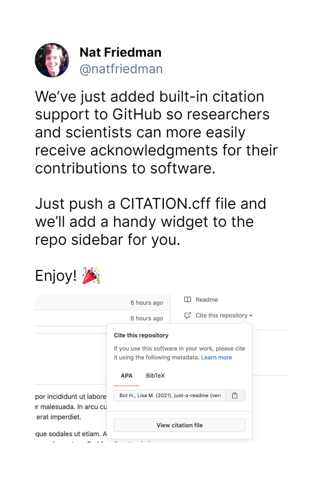

# Manipulating citations with cffr

**cffr** is designed for **R** package developers. Its main goal is to
create a `CITATION.cff` file using metadata from the following files:

- Your `DESCRIPTION` file.
- Citation information from `inst/CITATION`, when available.

## What is a `CITATION.cff` file?

A `CITATION.cff` file follows the [Citation File Format
(CFF)](https://citation-file-format.github.io/) ([Druskat et al.
2021](#ref-druskat_citation_2021)) (v1.2.0). It contains human- and
machine-readable citation metadata for software and datasets. Developers
can include it in a repository to explain how to cite their software.

This format is increasingly used in the software citation ecosystem.
[GitHub](https://docs.github.com/en/repositories/managing-your-repositorys-settings-and-features/customizing-your-repository/about-citation-files),
[Zenodo](https://citation-file-format.github.io/#/supported-by-zenodo-)
and
[Zotero](https://citation-file-format.github.io/#/supported-by-zotero-)
support this citation format ([Druskat
2021](#ref-druskat_stephan_making_2021)).

GitHub support is of special interest:



GitHub citation support announcement

Nat Friedman (@natfriedman) July 27, 2021

See [GitHub’s guide to CITATION
files](https://docs.github.com/en/repositories/managing-your-repositorys-settings-and-features/customizing-your-repository/about-citation-files)
for more information.

## Creating a `CITATION.cff` file for your R package

Creating a `CITATION.cff` file with **cffr** is straightforward. You
only need to run
[`cff_write()`](https://docs.ropensci.org/cffr/reference/cff_write.md):

``` r

library(cffr)

cff_write()

# Done.
```

Under the hood,
[`cff_write()`](https://docs.ropensci.org/cffr/reference/cff_write.md)
performs these tasks:

- Extracts the metadata using
  [`cff_create()`](https://docs.ropensci.org/cffr/reference/cff_create.md).
- Optionally modifies it with
  [`cff_modify()`](https://docs.ropensci.org/cffr/reference/cff_modify.md).
- Writes a `CITATION.cff` file.
- Validates the result using
  [`cff_validate()`](https://docs.ropensci.org/cffr/reference/cff_validate.md).

You now have a complete `CITATION.cff` file for your **R** package.

## Modifying your `CITATION.cff` file

You can customize a `cff` object using
[`cff_modify()`](https://docs.ropensci.org/cffr/reference/cff_modify.md),
the package’s coercion methods and the `keys` argument.

For demonstration, we create a `cff` object using
[`cff()`](https://docs.ropensci.org/cffr/reference/cff.md) and then add
or modify its contents.

### Adding new keys

``` r

newobject <- cff()

newobject
#> cff-version: 1.2.0
#> message: If you use this software, please cite it using these metadata.
#> title: My Research Software
#> authors:
#> - family-names: Doe
#>   given-names: John
```

The valid keys from the [Citation File Format schema version
1.2.0](https://github.com/citation-file-format/citation-file-format/blob/main/schema-guide.md)
can be displayed with
[`cff_schema_keys()`](https://docs.ropensci.org/cffr/reference/cff_schema.md):

``` r

cff_schema_keys()
#>  [1] "cff-version"         "message"             "type"               
#>  [4] "license"             "title"               "version"            
#>  [7] "doi"                 "identifiers"         "abstract"           
#> [10] "authors"             "preferred-citation"  "repository"         
#> [13] "repository-artifact" "repository-code"     "commit"             
#> [16] "url"                 "date-released"       "contact"            
#> [19] "keywords"            "references"          "license-url"
```

In this case, we add `url`, `version` and `repository`. We also
overwrite the `title` key by passing these arguments to
[`cff_modify()`](https://docs.ropensci.org/cffr/reference/cff_modify.md):

``` r

modobject <- cff_modify(
  newobject,
  url = "https://ropensci.org/",
  version = "0.0.1",
  repository = "https://github.com/ropensci/cffr",
  # If the key is already present, it is overridden.
  title = "Modifying a 'cff' object"
)

modobject
#> cff-version: 1.2.0
#> message: If you use this software, please cite it using these metadata.
#> title: Modifying a 'cff' object
#> authors:
#> - family-names: Doe
#>   given-names: John
#> url: https://ropensci.org/
#> version: 0.0.1
#> repository: https://github.com/ropensci/cffr

# Validate against the schema.

cff_validate(modobject)
#> ══ Validating CFF ══════════════════════════════════════════════════════════════
#> ✔ This <cff> object is valid.
```

### Persons and references

[`as_cff_person()`](https://docs.ropensci.org/cffr/reference/as_cff_person.md)
converts `person` objects and
[`as_cff()`](https://docs.ropensci.org/cffr/reference/as_cff.md)
converts `bibentry` objects to metadata that follows the [Citation File
Format
schema](https://github.com/citation-file-format/citation-file-format/blob/main/schema-guide.md).

Following the previous example, we first add a new author. To do that,
we need to extract the current package authors and append the converted
person:

``` r

# Valid person keys.

cff_schema_definitions_person()
#>  [1] "address"       "affiliation"   "alias"         "city"         
#>  [5] "country"       "email"         "family-names"  "fax"          
#>  [9] "given-names"   "name-particle" "name-suffix"   "orcid"        
#> [13] "post-code"     "region"        "tel"           "website"

# Create the person.

chiquito <- person(
  "Gregorio",
  "Sánchez Fernández",
  email = "fake@email2.com",
  comment = c(
    alias = "Chiquito de la Calzada",
    city = "Malaga",
    country = "ES",
    ORCID = "0000-0000-0000-0001"
  )
)

chiquito
#> [1] "Gregorio Sánchez Fernández <fake@email2.com> (alias: Chiquito de la Calzada, city: Malaga, country: ES, ORCID: <https://orcid.org/0000-0000-0000-0001>)"

# Convert to `cff`.
chiquito_cff <- as_cff_person(chiquito)
chiquito_cff
#> - family-names: Sánchez Fernández
#>   given-names: Gregorio
#>   email: fake@email2.com
#>   alias: Chiquito de la Calzada
#>   city: Malaga
#>   country: ES
#>   orcid: https://orcid.org/0000-0000-0000-0001

# Append to previous authors.

newauthors <- c(modobject$authors, chiquito_cff)
newauthors
#> - family-names: Doe
#>   given-names: John
#> - family-names: Sánchez Fernández
#>   given-names: Gregorio
#>   email: fake@email2.com
#>   alias: Chiquito de la Calzada
#>   city: Malaga
#>   country: ES
#>   orcid: https://orcid.org/0000-0000-0000-0001

newauthorobject <- cff_modify(modobject, authors = newauthors)

newauthorobject
#> cff-version: 1.2.0
#> message: If you use this software, please cite it using these metadata.
#> title: Modifying a 'cff' object
#> authors:
#> - family-names: Doe
#>   given-names: John
#> - family-names: Sánchez Fernández
#>   given-names: Gregorio
#>   email: fake@email2.com
#>   alias: Chiquito de la Calzada
#>   city: Malaga
#>   country: ES
#>   orcid: https://orcid.org/0000-0000-0000-0001
#> url: https://ropensci.org/
#> version: 0.0.1
#> repository: https://github.com/ropensci/cffr

cff_validate(newauthorobject)
#> ══ Validating CFF ══════════════════════════════════════════════════════════════
#> ✔ This <cff> object is valid.
```

Next, we add `references` to the `cff` object. This example adds two
references, one created with
[`bibentry()`](https://rdrr.io/r/utils/bibentry.html) and another with
[`citation()`](https://rdrr.io/r/utils/citation.html):

``` r

# Valid reference keys.

cff_schema_definitions_refs()
#>  [1] "abbreviation"        "abstract"            "authors"            
#>  [4] "collection-doi"      "collection-title"    "collection-type"    
#>  [7] "commit"              "conference"          "contact"            
#> [10] "copyright"           "data-type"           "database-provider"  
#> [13] "database"            "date-accessed"       "date-downloaded"    
#> [16] "date-published"      "date-released"       "department"         
#> [19] "doi"                 "edition"             "editors"            
#> [22] "editors-series"      "end"                 "entry"              
#> [25] "filename"            "format"              "identifiers"        
#> [28] "institution"         "isbn"                "issn"               
#> [31] "issue"               "issue-date"          "issue-title"        
#> [34] "journal"             "keywords"            "languages"          
#> [37] "license"             "license-url"         "loc-end"            
#> [40] "loc-start"           "location"            "medium"             
#> [43] "month"               "nihmsid"             "notes"              
#> [46] "number"              "number-volumes"      "pages"              
#> [49] "patent-states"       "pmcid"               "publisher"          
#> [52] "recipients"          "repository"          "repository-artifact"
#> [55] "repository-code"     "scope"               "section"            
#> [58] "senders"             "start"               "status"             
#> [61] "term"                "thesis-type"         "title"              
#> [64] "translators"         "type"                "url"                
#> [67] "version"             "volume"              "volume-title"       
#> [70] "year"                "year-original"

# Automatic coercion from another **R** package.
base_r <- citation("base")

bib <- bibentry(
  "Book",
  title = "This is a book",
  author = "Lisa Lee",
  year = 1980,
  publisher = "McGraw Hill",
  volume = 2
)

refs <- c(base_r, bib)

refs
#> R Core Team (2026). _R: A Language and Environment for Statistical
#> Computing_. R Foundation for Statistical Computing, Vienna, Austria.
#> doi:10.32614/R.manuals <https://doi.org/10.32614/R.manuals>.
#> <https://www.R-project.org/>.
#> 
#> Lee L (1980). _This is a book_, volume 2. McGraw Hill.

# Convert to `cff`.

refs_cff <- as_cff(refs)

refs_cff
#> - type: manual
#>   title: 'R: A Language and Environment for Statistical Computing'
#>   authors:
#>   - name: R Core Team
#>     website: https://ror.org/02zz1nj61
#>   institution:
#>     name: R Foundation for Statistical Computing
#>     website: https://ror.org/05qewa988
#>     address: Vienna, Austria
#>   year: '2026'
#>   doi: 10.32614/R.manuals
#>   url: https://www.R-project.org/
#> - type: book
#>   title: This is a book
#>   authors:
#>   - family-names: Lee
#>     given-names: Lisa
#>   year: '1980'
#>   publisher:
#>     name: McGraw Hill
#>   volume: '2'
```

As with the `person` example, we modify the `cff` object:

``` r

finalobject <- cff_modify(newauthorobject, references = refs_cff)

finalobject
#> cff-version: 1.2.0
#> message: If you use this software, please cite it using these metadata.
#> title: Modifying a 'cff' object
#> authors:
#> - family-names: Doe
#>   given-names: John
#> - family-names: Sánchez Fernández
#>   given-names: Gregorio
#>   email: fake@email2.com
#>   alias: Chiquito de la Calzada
#>   city: Malaga
#>   country: ES
#>   orcid: https://orcid.org/0000-0000-0000-0001
#> url: https://ropensci.org/
#> version: 0.0.1
#> repository: https://github.com/ropensci/cffr
#> references:
#> - type: manual
#>   title: 'R: A Language and Environment for Statistical Computing'
#>   authors:
#>   - name: R Core Team
#>     website: https://ror.org/02zz1nj61
#>   institution:
#>     name: R Foundation for Statistical Computing
#>     website: https://ror.org/05qewa988
#>     address: Vienna, Austria
#>   year: '2026'
#>   doi: 10.32614/R.manuals
#>   url: https://www.R-project.org/
#> - type: book
#>   title: This is a book
#>   authors:
#>   - family-names: Lee
#>     given-names: Lisa
#>   year: '1980'
#>   publisher:
#>     name: McGraw Hill
#>   volume: '2'

cff_validate(finalobject)
#> ══ Validating CFF ══════════════════════════════════════════════════════════════
#> ✔ This <cff> object is valid.
```

### Write the modified `CITATION.cff` file

The result can be written with
[`cff_write()`](https://docs.ropensci.org/cffr/reference/cff_write.md):

``` r

# Create a temporary output file.
tmp <- tempfile(fileext = ".cff")

see_res <- cff_write(finalobject, outfile = tmp)
#> ✔ 'C:\Users\diego\AppData\Local\Temp\RtmpGkRTGS\file661021287cac.cff' generated.
#> ══ Validating CFF ══════════════════════════════════════════════════════════════
#> ✔ 'C:\Users\diego\AppData\Local\Temp\RtmpGkRTGS\file661021287cac.cff' is valid.

cat(readLines(tmp), sep = "\n")
#> # ------------------------------------------------
#> # CITATION.cff file created with {cffr} R package
#> # See also: https://docs.ropensci.org/cffr/
#> # ------------------------------------------------
#>  
#> cff-version: 1.2.0
#> message: If you use this software, please cite it using these metadata.
#> title: Modifying a 'cff' object
#> version: 0.0.1
#> authors:
#> - family-names: Doe
#>   given-names: John
#> - family-names: Sánchez Fernández
#>   given-names: Gregorio
#>   email: fake@email2.com
#>   alias: Chiquito de la Calzada
#>   city: Malaga
#>   country: ES
#>   orcid: https://orcid.org/0000-0000-0000-0001
#> repository: https://github.com/ropensci/cffr
#> url: https://ropensci.org/
#> references:
#> - type: manual
#>   title: 'R: A Language and Environment for Statistical Computing'
#>   authors:
#>   - name: R Core Team
#>     website: https://ror.org/02zz1nj61
#>   institution:
#>     name: R Foundation for Statistical Computing
#>     website: https://ror.org/05qewa988
#>     address: Vienna, Austria
#>   year: '2026'
#>   doi: 10.32614/R.manuals
#>   url: https://www.R-project.org/
#> - type: book
#>   title: This is a book
#>   authors:
#>   - family-names: Lee
#>     given-names: Lisa
#>   year: '1980'
#>   publisher:
#>     name: McGraw Hill
#>   volume: '2'
```

Finally, we can read the created `CITATION.cff` file using
[`cff_read()`](https://docs.ropensci.org/cffr/reference/cff_read.md):

``` r

reading <- cff_read(tmp)

reading
#> cff-version: 1.2.0
#> message: If you use this software, please cite it using these metadata.
#> title: Modifying a 'cff' object
#> version: 0.0.1
#> authors:
#> - family-names: Doe
#>   given-names: John
#> - family-names: Sánchez Fernández
#>   given-names: Gregorio
#>   email: fake@email2.com
#>   alias: Chiquito de la Calzada
#>   city: Malaga
#>   country: ES
#>   orcid: https://orcid.org/0000-0000-0000-0001
#> repository: https://github.com/ropensci/cffr
#> url: https://ropensci.org/
#> references:
#> - type: manual
#>   title: 'R: A Language and Environment for Statistical Computing'
#>   authors:
#>   - name: R Core Team
#>     website: https://ror.org/02zz1nj61
#>   institution:
#>     name: R Foundation for Statistical Computing
#>     website: https://ror.org/05qewa988
#>     address: Vienna, Austria
#>   year: '2026'
#>   doi: 10.32614/R.manuals
#>   url: https://www.R-project.org/
#> - type: book
#>   title: This is a book
#>   authors:
#>   - family-names: Lee
#>     given-names: Lisa
#>   year: '1980'
#>   publisher:
#>     name: McGraw Hill
#>   volume: '2'
```

Note that
[`cff_write()`](https://docs.ropensci.org/cffr/reference/cff_write.md)
also has the `keys` argument, so the workflow can be simplified to:

``` r

allkeys <- list(
  "url" = "https://ropensci.org/",
  "version" = "0.0.1",
  "repository" = "https://github.com/ropensci/cffr",
  # If the key is already present, it is overridden.
  title = "Modifying a 'cff' object",
  authors = newauthors,
  references = refs_cff
)

tmp2 <- tempfile(fileext = ".cff")

res <- cff_write(cff(), outfile = tmp2, keys = allkeys)
#> ✔ 'C:\Users\diego\AppData\Local\Temp\RtmpGkRTGS\file661013d54cd.cff' generated.
#> ══ Validating CFF ══════════════════════════════════════════════════════════════
#> ✔ 'C:\Users\diego\AppData\Local\Temp\RtmpGkRTGS\file661013d54cd.cff' is valid.

res
#> cff-version: 1.2.0
#> message: If you use this software, please cite it using these metadata.
#> title: Modifying a 'cff' object
#> version: 0.0.1
#> authors:
#> - family-names: Doe
#>   given-names: John
#> - family-names: Sánchez Fernández
#>   given-names: Gregorio
#>   email: fake@email2.com
#>   alias: Chiquito de la Calzada
#>   city: Malaga
#>   country: ES
#>   orcid: https://orcid.org/0000-0000-0000-0001
#> repository: https://github.com/ropensci/cffr
#> url: https://ropensci.org/
#> references:
#> - type: manual
#>   title: 'R: A Language and Environment for Statistical Computing'
#>   authors:
#>   - name: R Core Team
#>     website: https://ror.org/02zz1nj61
#>   institution:
#>     name: R Foundation for Statistical Computing
#>     website: https://ror.org/05qewa988
#>     address: Vienna, Austria
#>   year: '2026'
#>   doi: 10.32614/R.manuals
#>   url: https://www.R-project.org/
#> - type: book
#>   title: This is a book
#>   authors:
#>   - family-names: Lee
#>     given-names: Lisa
#>   year: '1980'
#>   publisher:
#>     name: McGraw Hill
#>   volume: '2'
```

## References

Druskat, Stephan. 2021. *Making Software Citation Easi(er) - The
Citation File Format and Its Integrations*. Version 1. Zenodo.
<https://doi.org/10.5281/zenodo.5529914>.

Druskat, Stephan, Jurriaan H. Spaaks, Neil Chue Hong, et al. 2021.
*Citation File Format*. Version 1.2.0. Zenodo.
<https://doi.org/10.5281/zenodo.5171937>.
